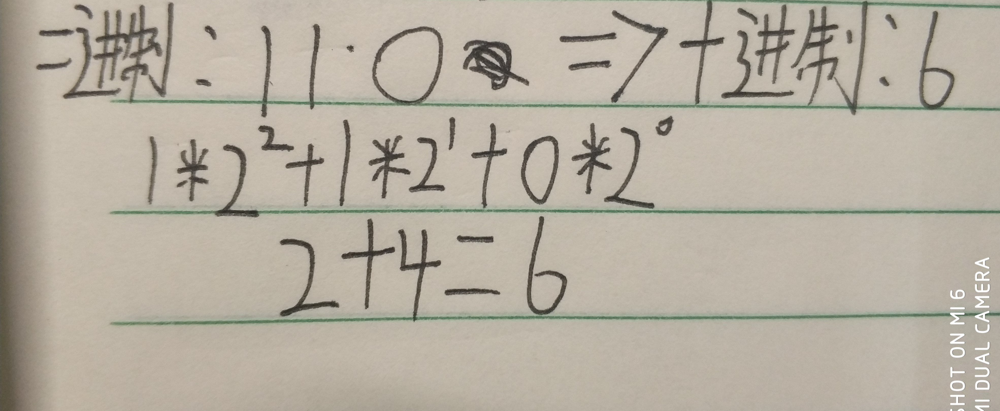

# HTML（超文本标记语言）

## 一个html文件整体大致结构


1. #### 声明版本

   ```html
   <!DOCTYPE html
   ```

2. #### 开头

   ```html
   <html lang="en">
   ```

3. #### 头部文件

   ```html
   <head>
   	<meta charset="UTF-8"><!--字符编码-->
   	<title></title><!--网页名称-->
   </head>
   ```

4. #### 主体

   ```html
   <body></body>
   ```

5. #### 结尾

   ```html
   </html>
   ```

   

## 标签笔记

### 标题标签(h1~h6)

```html
<h1>h1</h1>
<h1>h2</h1>
<h1>h3</h1>
<h1>h4</h1>
<h1>h5</h1>
<h1>h6</h1>
```

### 段落标签

```html
<p></p>
```

### 水平线

```html
<hr>
```

### 换行

```html
<br>
```

### 加粗

```html
<b></b>
```

### 斜体

```html
<i></i>
```

### 下划线

```html
<u></u>
```

### 有序列表

```html
<ol type="">
    <li>内容</li>
    <li>内容</li>
    <li>内容</li>
    <li>内容</li>
</ol>
```

### 无序列表

```html
<ul type="">
    <li>内容</li>
    <li>内容</li>
    <li>内容</li>
    <li>内容</li>
</ul>
```

### 自定义列表

```html
<dl>
	<dt>列表名称</dt>
    	<dd>列表内容</dd>
    	<dd>列表内容</dd>
        <dd>列表内容</dd>
        <dd>列表内容</dd>
    <dt>列表名称</dt>
    	<dd>列表内容</dd>
    	<dd>列表内容</dd>
        <dd>列表内容</dd>
        <dd>列表内容</dd>
</dl>
```

### 超链接

```html
<a href="" target="打开的地方(可填name的值)"></a>
```

### 锚点

```html
<a href="#id">  <p id="id">跳转目标</p>
```

### 图片

```html

```

### 固定格式化（写作用的）

```html
<pre></pre>
```

### 实体

```html
&nbsp;  ：空格
&lt;    ：小于号
&gt;    ：大于号
```

### 表格

```html
<table border="边框" align="left or right or center" valign="top or middle or bottom" cellspacing="外边框" cellpadding="内边框" >
    <caption>表格头自带居中效果</caption>
    <tr>
    	<td rowspan="合并行" colspan="合并列">这是第一行第一列</td>
        <td></td>
        <th></th><!--自带加粗效果-->
    </tr>
</table>
```

### 排版标签(无意义标签)

```html
<div>
   我是块标签 
</div>
<span>我是行标签</span>
```

### 通用属性

```html
<span>id class name style</span>
```

### 表单

```html
<form action="提交地址">
    <input type="text or password or radio or button or email or checkbox or submit or reset or file" placeholder="提示用户输入" focus="焦点" >
    <!--使用radio时所有radio的name必须一致-->
    <!--checked="checked"默认选项-->
    <!--H5新增属性：
		required：必填
		email：邮箱
		data：日期
		range：进度条
		number：数字
		color：颜色
	-->
</form>
```

### 文本域

```html
<textarea cols="宽" rows="高">
</textarea>
```

### 下拉列表

```html
<select>
    <optgroup></optgroup>
    <option></option>
    <option></option>
</select>
```

### 框架

```html
<frameset cols or rows = "">
    <frame></frame>
	<frameset>
    	<frame></frame>
	</frameset>
</frameset>
```

### 嵌入

```html
<iframe frameborder="边框" src="地址">
    
</iframe>
```

### 音频

```html
<audio src="地址" controls autoplay><!--controls：控制器    autoplay：自动播放 loop：循环播放-->
    <source src="如果文件失效就播放这一个">
</audio>
	
```

### 视频

```html
<video src="" controls autoplay><!--controls：控制器    autoplay：自动播放 loop：循环播放-->
    <source src="如果文件失效就播放这一个">
	<poster src="图片地址"></poster>
</video>
```


## 颜色

英文单词取色：red or blue.....

rgb取色：

1. (0~255,0~255,0~255):(红,绿,蓝)
2. #FFFFFF:两个F一个颜色 

## 进制

### 二进制转十进制



### 十进制转二进制


### 其他进制转换参考二进制与十进制之间的转换

## 路径

### 相对路径

```.```为当前路径

```..```上级

相对路径以当前文件所在位置为参照物

### 绝对路径

以盘符为参照路径